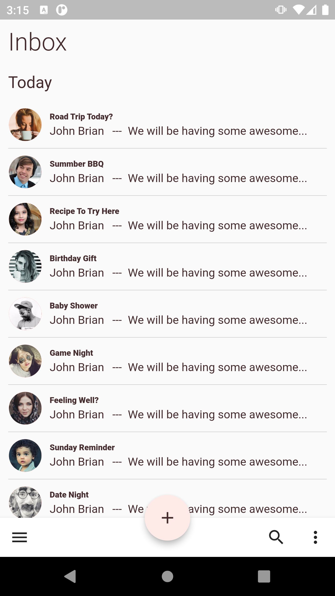

# MATERIAL DESIGN FLUTTER WIDGETS

## [Bottom Navigation Bar](https://github.com/Njuguna-JohnBrian/Flutter-Widgets/tree/master/app_bar_bottom)

- - Bottom app bars provide access to a bottom navigation drawer and up to four actions, including the floating action button.

### Use Cases

- Mobile Device Only

- Access To Bottom Navigation drawer

- Screens with 2 or five actions

## Screens

## [Top Navigation Bar](https://github.com/Njuguna-JohnBrian/Flutter-Widgets/tree/master/app_bar_top)

- - The top app bar provides content and actions related to the current screen. It’s used for branding, screen titles, navigation, and actions.

- - It can transform into a contextual action bar.

## Screens

